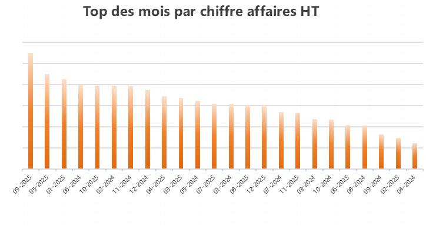
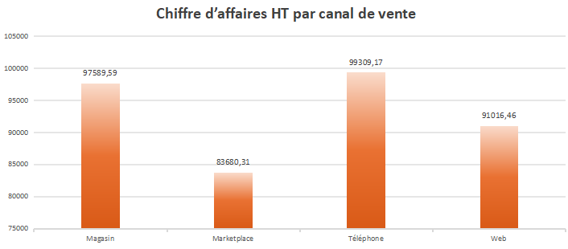

\# SalesInsight BI — Analyse des ventes avec Excel, Python, SQL et Machine Learning

\## Présentation du projet

SalesInsight BI est un projet personnel de Business Intelligence et Data Analysis basé sur une base de données fictive d’entreprise.

L’objectif est d’analyser les ventes, identifier les meilleurs canaux de vente, les produits les plus performants, les clients les plus rentables et développer un modèle de Machine Learning pour prédire les commandes de forte valeur.

Ce projet a été réalisé dans le cadre de ma préparation au Master MIAGE — parcours Ingénierie des Données et Analyses.

\## Objectifs

\- Construire un dashboard Excel avec des KPI commerciaux

\- Analyser les ventes avec Python et Pandas

\- Réaliser des requêtes SQL pour interroger les données

\- Créer des visualisations de données

\- Développer un modèle de Machine Learning avec Random Forest

\- Présenter les résultats sous forme d’analyse métier

\## Données utilisées

Le fichier Excel contient plusieurs tables :

\- Clients

\- Produits

\- Commandes

\- Lignes\_Commandes

\- Employés

Les données sont fictives et représentent l’activité commerciale d’une entreprise.

\## Outils utilisés

\- Excel / WPS Office

\- Google Colab

\- Python

\- Pandas

\- Matplotlib

\- Scikit-learn

\- SQLite

\- SQL

\## Résultats principaux

\- Chiffre d’affaires HT total : 368 992,73 €

\- Nombre de commandes : 420

\- Nombre de clients : 119

\- Panier moyen HT : 878,55 €

\- Meilleur mois : septembre 2025

\- Meilleur canal de vente : Téléphone

\- Meilleure catégorie : Formation

\- Meilleur produit : Laptop Pro 14

\- Meilleur client : Vincent

## Aperçu du dashboard

\## Machine Learning

Un modèle Random Forest a été entraîné pour prédire les commandes de forte valeur.

La commande de forte valeur est définie comme une commande dont le chiffre d’affaires HT est supérieur à la médiane.

\- Seuil de forte valeur : 510,17 €

\- Accuracy : 71,4 %

\- Recall pour les commandes de forte valeur : 76 %

Les variables les plus importantes sont :

1\. Quantité totale

2\. Remise moyenne

3\. Nombre de produits

4\. Canal de vente

\## Compétences développées

\- Nettoyage et préparation des données

\- Fusion de tables avec Pandas

\- Création de KPI

\- Tableaux croisés dynamiques

\- Dashboard Excel

\- Analyse exploratoire des données

\- Requêtes SQL avec jointures

\- Classification avec Random Forest

\- Interprétation des résultats

\- Data storytelling

\## Conclusion

Ce projet montre ma capacité à transformer des données brutes en informations utiles pour l’entreprise. Il combine Business Intelligence, analyse de données, SQL et Machine Learning dans un cas pratique orienté métier.

